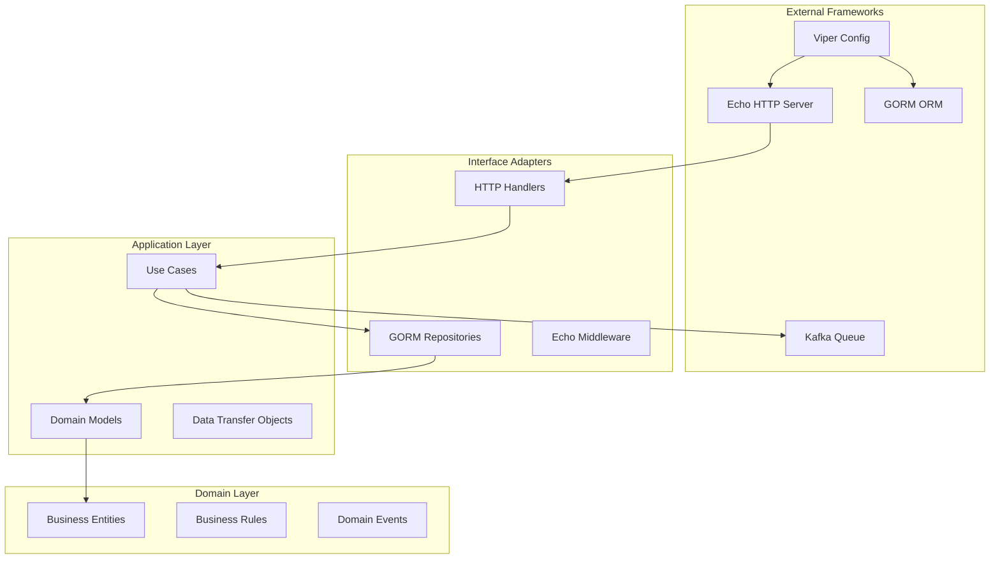
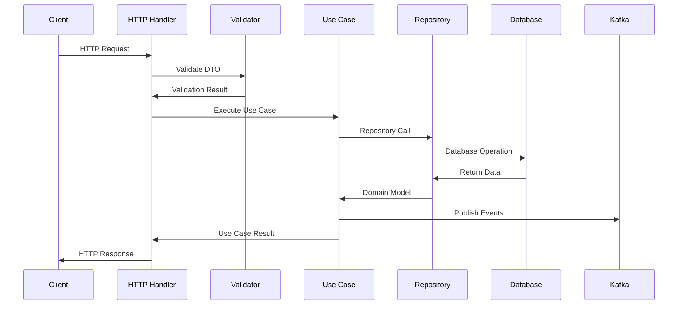

# Sequence Service - Architecture Documentation

## Table of Contents

1. [Overview](#overview)
2. [System Architecture](#system-architecture)
3. [Technology Stack](#technology-stack)
4. [Project Structure](#project-structure)
5. [Domain Model](#domain-model)
6. [API Design](#api-design)
7. [Database Design](#database-design)
8. [Configuration Management](#configuration-management)
9. [Logging & Monitoring](#logging--monitoring)
10. [Development Guidelines](#development-guidelines)

## Overview

The Sequence Service is a high-performance email sequencing platform that enables businesses to create, manage, and execute multi-step email campaigns with intelligent scheduling and capacity management.

### Key Features

- **Sequence Management**: Create and manage multi-step email sequences
- **Capacity-Aware Scheduling**: Intelligent email distribution across multiple mailboxes
- **Contact Management**: Bulk contact processing with segmentation
- **Real-time Analytics**: Track email delivery, opens, and engagement
- **Scalable Architecture**: Designed to handle 50k+ contacts and 200+ mailboxes

## System Architecture

### Clean Architecture Implementation



### Data Flow



## Technology Stack

### Core Framework

- **Go 1.23+**: Primary programming language
- **Echo v4**: High-performance HTTP framework
- **GORM v2**: Object-Relational Mapping library
- **Viper**: Configuration management

### Database

- **PostgreSQL 13+**: Primary data store
- **Goose**: Database migration tool

### Messaging & Queue

- **Kafka**: Message queue for email processing
- **Sarama**: Go Kafka client library

### Development Tools

- **Slog**: Structured logging
- **Validator v10**: Request validation
- **Mockgen**: Testing framework

## Project Structure

```
sequence-service/
├── cmd/
│   └── app/
│       └── main.go                     # Application entry point
└── configs/
│   ├── app.config.local.yml            # Configuration file
│   └── app.config.dev.yaml             # Development config
├── database/
│   ├── migrations/                     # Goose migration files
│   └── seeders/                        # Database seed data
├── docs/
│   ├── swagger/                        # OpenAPI documents
│   └── architecture-decisions/         # documents
├── files/
│   ├── mocks/                          # Mocks files
│   └── testdata/                       # Testdata
├── internal/
│   ├── app/
│   │   └── app.go                      # Application initialization
│   ├── config/
│   │   └── config.go                   # Configuration structures
│   ├── dto/                            # Request, Response DTOs
│   ├── models/                         # GORM models
│   └── module/
│   │   └── workflow/                   # Core business domain
│   │      ├── repository/
│   │      │   └── repository.go        # Data access layer
│   │      ├── usecase/
│   │      │   └── usecase.go           # Business logic
│   │      └── delivery/
│   │      │     └── https/
│   │      │      └── handler.go        # HTTP handlers
|   |      └── workflow.go              # Domain methods signature
│   └──  pkg/
│       ├── database/
│       │   └── postgres.go             # GORM database setup
│       ├── logger/
│       │   └── logger.go               # Structured logging
│       ├── middleware/
│       │   └── middleware.go
│       ├── ctx/
│       │   └── ctx.go                  # Custom context
│       └── transporter/                # Kafka
│           └── kafka.go
│── .gitignore
│── go.mod
│── go.sum
│── Makefile
└── README.md

```

## Domain Model

### Core Entities

#### Sequence

Represents an email sequence with multiple steps

```go
type Sequence struct {
    ID                   uuid.UUID
    Name                 string
    OpenTrackingEnabled  bool
    ClickTrackingEnabled bool
    Steps                []Step
    CreatedAt            time.Time
    UpdatedAt            time.Time
}
```

#### Step

Individual email step within a sequence

```go
type Step struct {
    ID         uuid.UUID
    SequenceID uuid.UUID
    StepOrder  int
    Subject    string
    Content    string
    WaitDays   int
}
```

#### Mailbox

Email account used for sending sequences

```go
type Mailbox struct {
    ID                   uuid.UUID
    Email                string
    DailyCapacity        int      // Default: 30 emails/day
    Status               string   // active, inactive, suspended
    Provider             string   // gmail, outlook, etc.
    SMTPConfig           SMTPConfig
}
```

#### Contact

Recipient of email sequences

```go
type Contact struct {
    ID        uuid.UUID
    Email     string
    FirstName string
    LastName  string
    Company   string
    Status    string // active, bounced, unsubscribed
}
```

## API Design

### RESTful Endpoints

#### Sequence Management

```
POST   /api/v1/sequences          # Create new sequence
GET    /api/v1/sequences          # List sequences
GET    /api/v1/sequences/:id      # Get sequence details
PUT    /api/v1/sequences/:id      # Update sequence
DELETE /api/v1/sequences/:id      # Delete sequence
```

#### Step Management

```
PUT    /api/v1/sequences/:id/steps/:stepId      # Update step content
DELETE /api/v1/sequences/:id/steps/:stepId      # Delete step
```

#### [TODO] Contact Management

```
POST   /api/sequences/:id/contacts  # Add contacts to sequence
GET    /api/sequences/:id/contacts  # List sequence contacts
```

### Request/Response Examples

#### Create Sequence

```http
POST /api/v1/sequences
Content-Type: application/json

{
  "name": "Onboarding Sequence",
  "open_tracking_enabled": true,
  "click_tracking_enabled": true,
  "steps": [
    {
      "step_order": 0,
      "subject": "Welcome to Our Platform",
      "content": "Hi {first_name}, welcome!",
      "wait_days": 0
    }
  ]
}
```

## Database Design

### Schema Overview

```sql
-- Core sequence tables
sequences (id, name, open_tracking_enabled, click_tracking_enabled, created_at, updated_at)
steps (id, sequence_id, step_order, subject, content, wait_days, created_at, updated_at)

-- Email infrastructure
mailboxes (id, email, daily_capacity, status, provider, smtp_config, created_at)
sequence_mailboxes (sequence_id, mailbox_id)

-- Contact management
contacts (id, email, first_name, last_name, company, status, created_at)
sequence_contacts (id, sequence_id, contact_id, current_step, next_send_at, status)

-- Email queue system
email_queues (id, sequence_contact_id, mailbox_id, step_order, scheduled_for, status)
mailbox_daily_counts (mailbox_id, date, sent_count)
```

### Migrations

Migrations are managed using Goose and located in `database/migrations/`:

```bash
# Run migrations
make migration-up

# Create new migration
make migration-down
```

## Configuration Management

### Viper Configuration

#### Configuration Structure

```go
 type config struct {
  Port string `mapstructure:"PORT"`
  DB   DB     `mapstructure:"DB"`
 }
 type DB struct {
  Host             string `mapstructure:"HOST"`
  Port             string `mapstructure:"PORT"`
  Name             string `mapstructure:"NAME"`
  User             string `mapstructure:"USER"`
  Password         string `mapstructure:"PASSWORD"`
  MaxIdleConns     int    `mapstructure:"MAX_IDLE_CONNS"`
  MaxOpenConns     int    `mapstructure:"MAX_OPEN_CONNS"`
  MaxLifetimeConns int    `mapstructure:"MAX_LIFETIME_CONNS"`
  SSLMode          string `mapstructure:"SSL_MODE"`
 }
```

#### Configuration Files

```yaml
# configs/app.config.local.yml
PORT: 8080

DB:
  HOST: localhost
  PORT: 5432
  NAME: sequence_db
  USER: root
  PASSWORD: root
  MAX_IDLE_CONNS: 10
  MAX_OPEN_CONNS: 100
  MAX_LIFETIME_CONNS: 300
  SSL_MODE: disable

```

## Logging & Monitoring

### Structured Logging

```go
func (h *workflowHandler) CreateSequence(c echo.Context) error {
 ac := c.(*ctx.CustomApplicationContext)

 reqPayload := new(dto.CreateSequenceRequest)
 if err := ac.CustomBind(reqPayload); err != nil {
  ac.AppLoger.Errorf("CreateSequence - validation error: %v", err)
  return ac.CustomResponse(http.StatusText(http.StatusBadRequest), nil, "", err.Error(), http.StatusBadRequest, nil)
 }

 resp, err := h.usecase.CreateSequence(c, reqPayload)
 if err != nil {
  ac.AppLoger.Errorf("CreateSequence - usecase error: %v", err)
  return ac.CustomResponse(http.StatusText(http.StatusInternalServerError), nil, "", err.Error(), http.StatusInternalServerError, nil)
 }

 ac.AppLoger.Infof("CreateSequence - sequence created with ID: %s", resp.ID)
 return ac.CustomResponse("Sequence created successfully", resp, "", "", http.StatusCreated, nil)
}
```

### Log Format

```json
{
  "time": "2024-01-15T10:30:00Z",
  "level": "INFO",
  "msg": "sequence created",
  "source": "handler.go:45:CreateSequence()",
  "prefix": "SEQUENCE-SERVICE",
  "requestID": "req-123456",
}
```

## Development Guidelines

### Code Organization

#### 1. Use Case Pattern

```go
// Use case interface
type Usezase interface {
    CreateSequence(ctx context.Context, req dto.CreateSequenceRequest) (*models.Sequence, error)
    GetSequence(ctx context.Context, id uuid.UUID) (*models.Sequence, error)
}

// Use case implementation
type workflowUsecase struct {
 repository workflow.Repository
}

func NewWorkflowUsecase(repository workflow.Repository) workflow.Usecase {
 return &workflowUsecase{
  repository: repository,
 }
}
func (u *workflowUsecase) CreateSequence(c echo.Context, req *dto.CreateSequenceRequest) (*dto.CreateSequenceResponse, error) {
    // Business logic and validation
    // Repository calls
}
```

#### 2. Repository Pattern

```go
type Repository interface {
 CreateSequence(tx *gorm.DB, sequence *models.Sequence) (*models.Sequence, error)
 GetSequence(sequenceID uuid.UUID) (*models.Sequence, error)
 UpdateSequenceTracking(tx *gorm.DB, sequence *models.Sequence) error
}
type healthRepository struct {
 db *gorm.DB
}

func NewHealthRepository(db *gorm.DB) health.Repository {
 return &healthRepository{
  db: db,
 }
}

```

#### 3. Handler Pattern

```go
type workflowHandler struct {
 usecase workflow.Usecase
}

func NewWorkflowHandler(e *echo.Echo, usecase workflow.Usecase) {
 h := &workflowHandler{
  usecase: usecase,
 }

 api := e.Group("/api/v1")

 api.POST("/sequence", h.CreateSequence)

}

```

### Testing Strategy

#### Unit Tests

```go
func TestSequenceUseCase_CreateSequence(t *testing.T) {
    // Setup
    mockRepo := new(MockSequenceRepository)
    mockProducer := new(MockEmailProducer)
    useCase := NewSequenceUseCase(mockRepo, mockProducer)

    // Test
    sequence, err := useCase.CreateSequence(context.Background(), validRequest)

    // Assertions
    assert.NoError(t, err)
    assert.NotNil(t, sequence)
    mockRepo.AssertExpectations(t)
}

```
