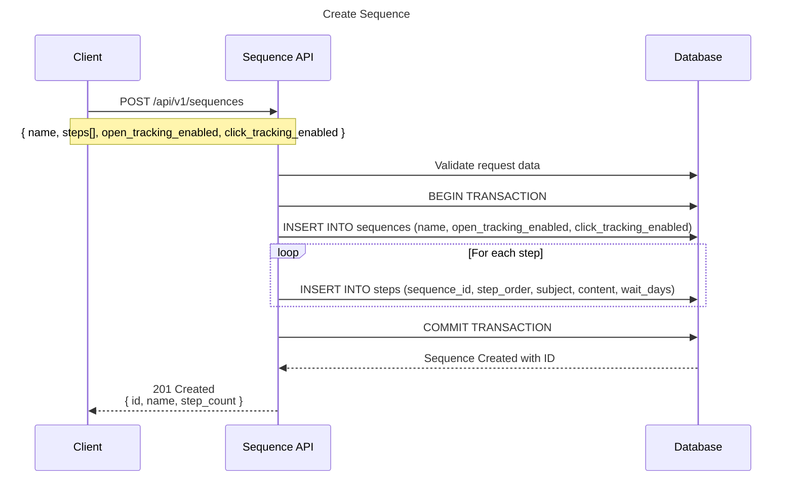
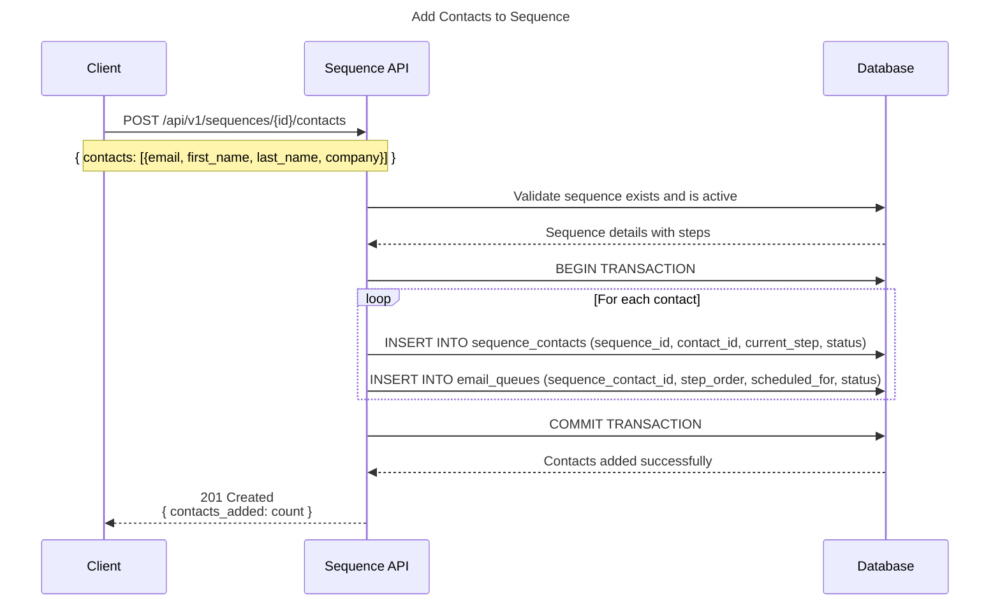
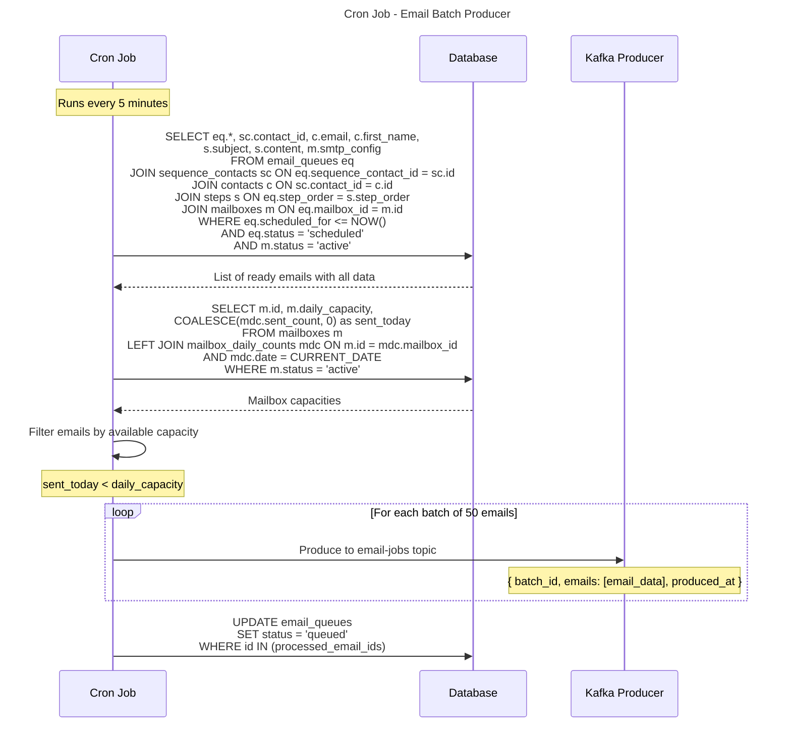
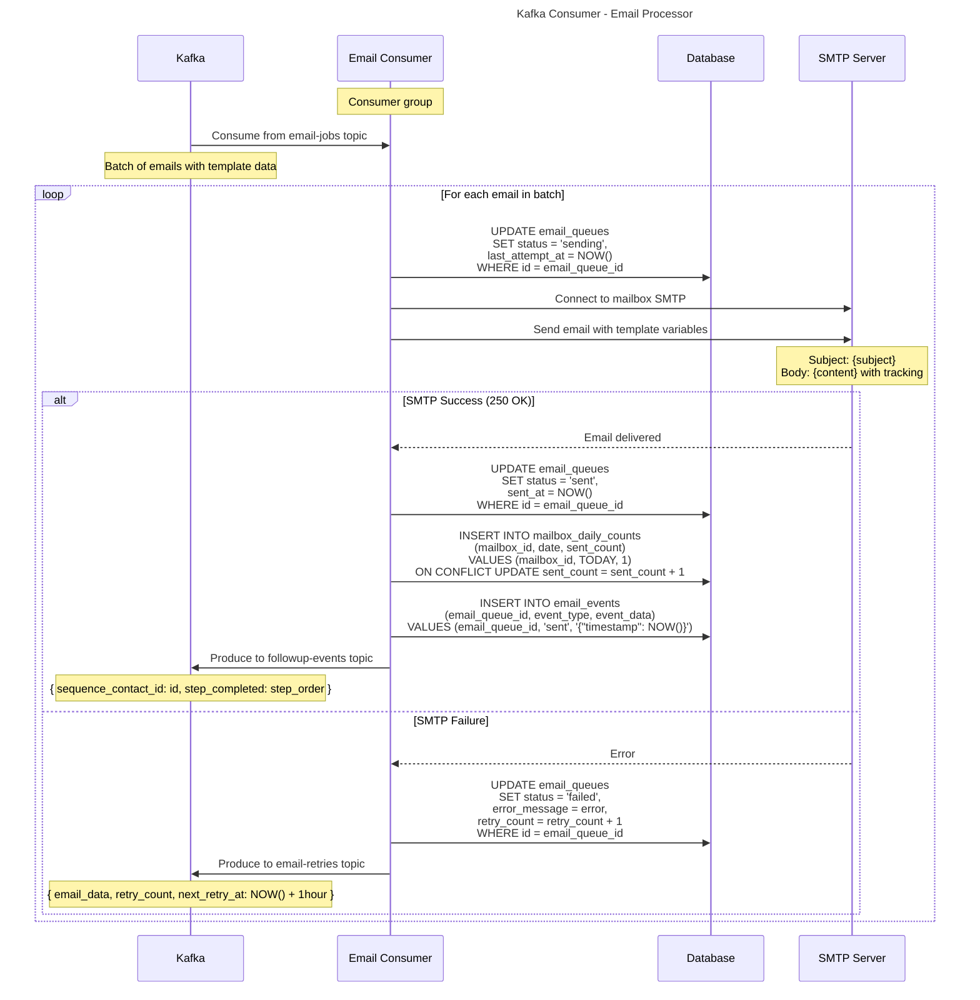
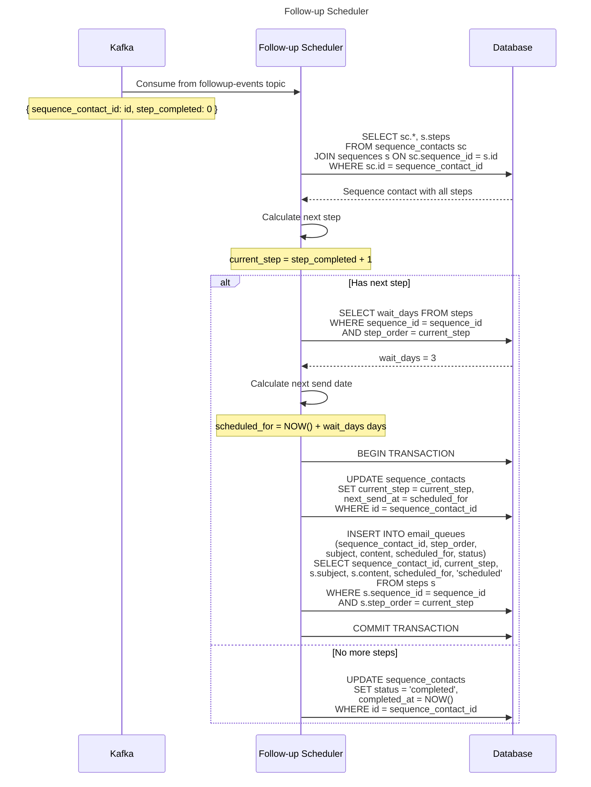
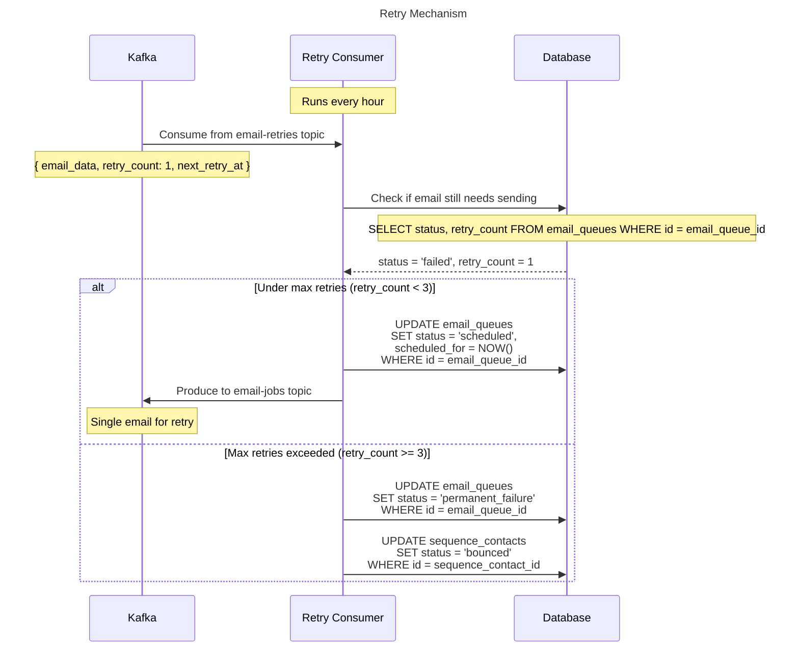

# Email Sequence System

## System Flow Overview

Email sequencing system with Kafka for async email processing. Cron jobs push email batches to Kafka topics. and the consumer process the mail daily 

## 1. Sequence Creation



## 2. Add Contacts to Sequence



## 3. Cron Job - Email Batch Producer



## 4. Kafka Consumer - Email Processor



## 5. Follow-up Scheduler



## 6. Retry Mechanism



## Database Schema (Accurate)

```sql
-- Core domain tables
CREATE TABLE sequences (
    id UUID PRIMARY KEY DEFAULT gen_random_uuid(),
    name VARCHAR(255) NOT NULL,
    open_tracking_enabled BOOLEAN DEFAULT true,
    click_tracking_enabled BOOLEAN DEFAULT true,
    created_at TIMESTAMP WITH TIME ZONE DEFAULT CURRENT_TIMESTAMP,
    updated_at TIMESTAMP WITH TIME ZONE DEFAULT CURRENT_TIMESTAMP,
    deleted_at TIMESTAMP WITH TIME ZONE
);

CREATE TABLE steps (
    id UUID PRIMARY KEY DEFAULT gen_random_uuid(),
    sequence_id UUID NOT NULL REFERENCES sequences(id) ON DELETE CASCADE,
    step_order INTEGER NOT NULL,
    subject TEXT NOT NULL,
    content TEXT NOT NULL,
    wait_days INTEGER NOT NULL DEFAULT 1,
    created_at TIMESTAMP WITH TIME ZONE DEFAULT CURRENT_TIMESTAMP,
    updated_at TIMESTAMP WITH TIME ZONE DEFAULT CURRENT_TIMESTAMP,
    deleted_at TIMESTAMP WITH TIME ZONE
);

CREATE TABLE mailboxes (
    id UUID PRIMARY KEY DEFAULT gen_random_uuid(),
    email VARCHAR(255) UNIQUE NOT NULL,
    daily_capacity INTEGER DEFAULT 30,
    status mailbox_status DEFAULT 'active',
    provider VARCHAR(100),
    smtp_host VARCHAR(255),
    smtp_port INTEGER,
    smtp_username VARCHAR(255),
    encrypted_smtp_password BYTEA,
    created_at TIMESTAMP WITH TIME ZONE DEFAULT CURRENT_TIMESTAMP,
    updated_at TIMESTAMP WITH TIME ZONE DEFAULT CURRENT_TIMESTAMP,
    deleted_at TIMESTAMP WITH TIME ZONE
);

CREATE TABLE sequence_mailboxes (
    sequence_id UUID REFERENCES sequences(id) ON DELETE CASCADE,
    mailbox_id UUID REFERENCES mailboxes(id) ON DELETE CASCADE,
    created_at TIMESTAMP WITH TIME ZONE DEFAULT CURRENT_TIMESTAMP,
    PRIMARY KEY (sequence_id, mailbox_id)
);

CREATE TABLE contacts (
    id UUID PRIMARY KEY DEFAULT gen_random_uuid(),
    email VARCHAR(255) NOT NULL,
    first_name VARCHAR(100),
    last_name VARCHAR(100),
    company VARCHAR(255),
    phone VARCHAR(50),
    status contact_status DEFAULT 'active',
    created_at TIMESTAMP WITH TIME ZONE DEFAULT CURRENT_TIMESTAMP,
    updated_at TIMESTAMP WITH TIME ZONE DEFAULT CURRENT_TIMESTAMP,
    deleted_at TIMESTAMP WITH TIME ZONE
);

CREATE TABLE sequence_contacts (
    id UUID PRIMARY KEY DEFAULT gen_random_uuid(),
    sequence_id UUID NOT NULL REFERENCES sequences(id) ON DELETE CASCADE,
    contact_id UUID NOT NULL REFERENCES contacts(id) ON DELETE CASCADE,
    current_step INTEGER DEFAULT 0,
    next_send_at TIMESTAMP WITH TIME ZONE,
    status sequence_contact_status DEFAULT 'pending',
    started_at TIMESTAMP WITH TIME ZONE,
    completed_at TIMESTAMP WITH TIME ZONE,
    created_at TIMESTAMP WITH TIME ZONE DEFAULT CURRENT_TIMESTAMP,
    updated_at TIMESTAMP WITH TIME ZONE DEFAULT CURRENT_TIMESTAMP,
    UNIQUE(sequence_id, contact_id)
);

CREATE TABLE email_queues (
    id UUID PRIMARY KEY DEFAULT gen_random_uuid(),
    sequence_contact_id UUID NOT NULL REFERENCES sequence_contacts(id) ON DELETE CASCADE,
    mailbox_id UUID REFERENCES mailboxes(id) ON DELETE SET NULL,
    step_order INTEGER NOT NULL,
    subject TEXT NOT NULL,
    content TEXT NOT NULL,
    scheduled_for TIMESTAMP WITH TIME ZONE NOT NULL,
    status email_queue_status DEFAULT 'scheduled',
    retry_count INTEGER DEFAULT 0,
    max_retries INTEGER DEFAULT 3,
    last_attempt_at TIMESTAMP WITH TIME ZONE,
    sent_at TIMESTAMP WITH TIME ZONE,
    error_message TEXT,
    created_at TIMESTAMP WITH TIME ZONE DEFAULT CURRENT_TIMESTAMP,
    updated_at TIMESTAMP WITH TIME ZONE DEFAULT CURRENT_TIMESTAMP
);

CREATE TABLE mailbox_daily_counts (
    mailbox_id UUID REFERENCES mailboxes(id) ON DELETE CASCADE,
    date DATE NOT NULL,
    sent_count INTEGER DEFAULT 0,
    failed_count INTEGER DEFAULT 0,
    reset_at TIMESTAMP WITH TIME ZONE DEFAULT CURRENT_TIMESTAMP,
    PRIMARY KEY (mailbox_id, date)
);

CREATE TABLE email_events (
    id UUID PRIMARY KEY DEFAULT gen_random_uuid(),
    email_queue_id UUID REFERENCES email_queues(id) ON DELETE CASCADE,
    event_type email_event_type NOT NULL,
    event_data JSONB,
    created_at TIMESTAMP WITH TIME ZONE DEFAULT CURRENT_TIMESTAMP
);

CREATE TABLE kafka_batches (
    id UUID PRIMARY KEY DEFAULT gen_random_uuid(),
    topic VARCHAR(100) NOT NULL,
    partition INTEGER NOT NULL,
    offset BIGINT NOT NULL,
    processed_at TIMESTAMPTZ DEFAULT NOW(),
    email_count INTEGER DEFAULT 0,
    batch_size INTEGER DEFAULT 0
);
```

## Kafka Topics Configuration

```yaml
topics:
  email-jobs:
    purpose: "Primary email processing queue"

  followup-events:
    purpose: "Trigger follow-up email scheduling"

  email-retries:
    purpose: "Failed email retries with exponential backoff"

  email-events:
    purpose: "Email tracking and analytics events"
```

## Highlights

- **Async Processing**: Non-blocking email sending with Kafka
- **Scalability**: Horizontal scaling of consumer instances
- **Fault Tolerance**: Automatic retries with exponential backoff
- **Capacity Management**: Respects mailbox daily limits
- **Monitoring**: Comprehensive tracking of all email events
- **Reliability**: Database transactions ensure data consistency
- **Performance**: Batch processing of emails per Kafka message
